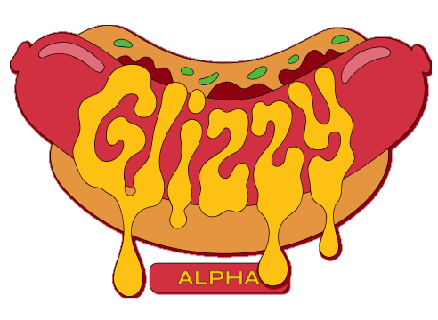

<p align="center">
  
</p>

<p align="center">
  <strong>A shadcn/ui-inspired UI library for Gleam and Lustre</strong>
</p>

<p align="center">
  <a href="https://hex.pm/packages/glizzy"></a>
  <a href="https://hexdocs.pm/glizzy"></a>
  <a href="https://tantalumv.github.io/Glizzy/"></a>
  <a href="https://github.com/tantalumv/Glizzy/blob/main/LICENSE"></a>
</p>

---

## What is Glizzy UI?

Glizzy UI is a comprehensive UI component library built for [Gleam](https://gleam.run) and [Lustre](https://lustre.dev). Inspired by [shadcn/ui](https://ui.shadcn.com), it provides beautifully designed, accessible, and customizable components for building modern web applications.

## Features

- **60+ Components** - Buttons, inputs, dialogs, navigation, layout, and more
- **Accessible** - WAI-ARIA compliant with keyboard navigation
- **Customizable** - Easy to theme and style
- **Type-Safe** - Full Gleam type safety
- **Zero Dependencies** - Built on Lustre 5.x

## Quick Start

### Installation

```bash
gleam add glizzy
```

### Usage

```gleam
import glizzy/ui/button
import lustre.{type Msg, element}
import lustre/element.{button, text}

fn view(msg: Msg) -> element(Msg) {
  button.button(
    ~{
      variant: button.Primary,
      size: button.Default,
      disabled: False,
      onclick: Some(Clicked),
    },
    [text("Click me!")],
  )
}
```

## Components

| Category | Components |
|----------|------------|
| **Core** | Button, Checkbox, Input, Radio, Select, Slider, Switch |
| **Forms** | Calendar, Date Field, Date Picker, Number Field, Search Field, Text Field, Time Field |
| **Layout** | Box, Cluster, Stack, Sequence, Centre, Aside, Divider, Separator |
| **Navigation** | Breadcrumbs, Link, Menu, Tabs, Toolbar |
| **Overlay** | Dialog, Modal, Popover, Tooltip, Disclosure |
| **Data Display** | Avatar, Badge, Chip, KBD, Table, Tree |
| **Feedback** | Alert, Meter, Progress Bar, Skeleton, Spinner, Toast |
| **Selection** | Autocomplete, Checkbox Group, Combobox, Grid List, List Box, Radio Group, Tag Group, Toggle Button |
| **Color** | Color Area, Color Field, Color Picker, Color Slider, Color Swatch, Color Wheel |
| **Advanced** | Drop Zone, File Trigger, Virtualizer, Split Panel |

## Documentation

- [Getting Started](docs/guides/getting_started.md)
- [Component Documentation](docs/index.md)
- [Accessibility Guide](docs/guides/accessibility.md)
- [Theming Guide](docs/guides/theming.md)
- [Keyboard Keymaps](docs/guides/keymaps.md)

## Examples

Check out the [example application](examples/lustre_app/) for a complete demo of all components.

```bash
cd examples/lustre_app
gleam run
```

## Development

### Build

```bash
gleam build
```

### Test

```bash
gleam test
```

### Format

```bash
gleam format
```

### E2E Tests

```bash
bun install
bunx playwright test
```

## License

MIT License - see [LICENSE](LICENSE) for details.

## Acknowledgments

- [shadcn/ui](https://ui.shadcn.com) - Design inspiration
- [Lustre](https://lustre.dev) - The Elm-inspired FRP library for Gleam
- [Gleam](https://gleam.run) - The friendly language for robust type systems
